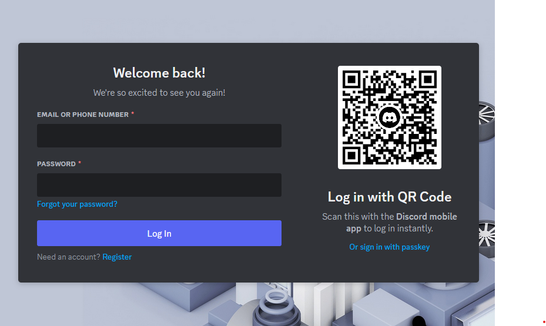
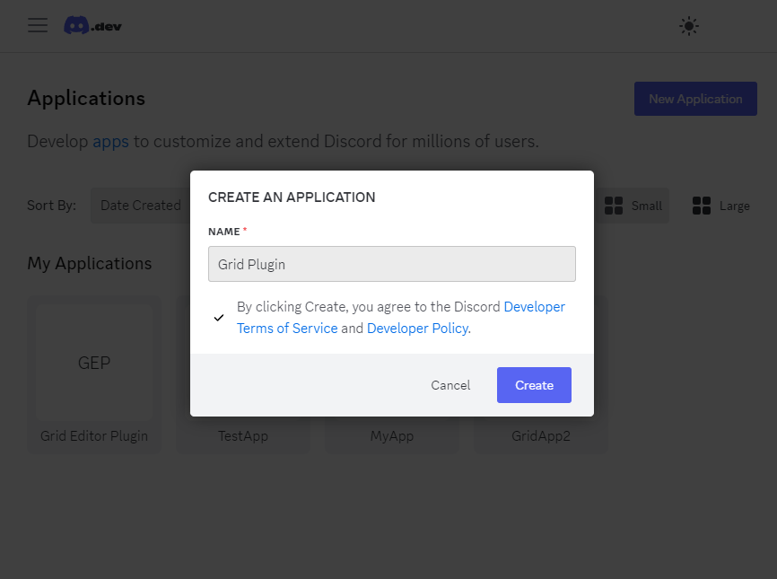
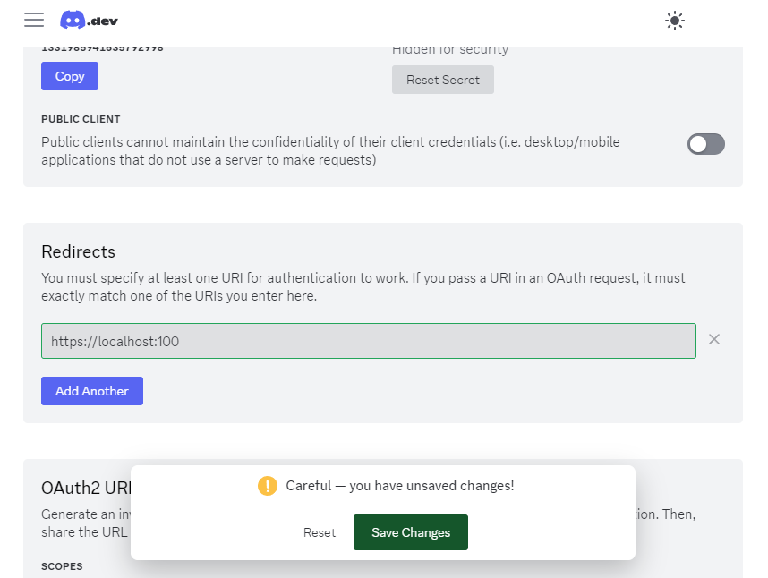

# Discord App creation guide

The Discord package for the Grid Editor:tm: framework supports changing the voice state (mute / deafen) of the user and allows the user to join or leave a given voice channel through Grid Module Actions. Discord only allows one external interface to control the user's own voice state, which unfortunately requires that the user registers a new (private) Discord App. This guide helps you through the steps.

1.  **Sign in to the Discord Developer Platform**
    After pressing the "Create Discord App" button in the Preferences window, the Discord Developer site should open in a new window. You will be required to sign in with your normal Discord Account.
    If you want to do this in your browser instead, you can [use the following link as well](https://discord.com/login?redirect_to=/developers/applications?new_application=true).
    
2.  **Create the Discord Application**
    A dialog should automatically open asking for the application name (if not, click the "New Application" button in the upper right corner). You can set any name you want. We will use GridPlugin in the tutorial.
    
3.  **Fill in the OAuth2 redirect URL**
    To be able to connect with the Discord client, Discord requires a **OAuth2 redirect URL**. This is not used by any party in this case, but still is a requirement. To set this up, use the menu in the Developer Page and navigate to the OAuth2 page. In the **Redirects** box, press the "Add Redirect" button, and put in a valid HTTP address. For example, you may use "https://localhost:100".
    

4.  **Paste the application values into the Preference page**
    You will need two values to authorize the Grid Editor Package with the Discord client:

- Client Id: This can be found on the OAuth2 page under the Client Information / Client ID part. Copy this value into the "Client ID" field in the Preferences page of the Package.
- Client Secret: This is found on the right side of the Client Information box. You will need to press the "Reset secret" button, and authenticate yourself again. Afterwards, a secret identification string will be shown. Copy this into the "Client Secret" field.

5. **Authorize the Package**
   If everything is set up correctly and Discord is running, pressing the "Authorize" button in the package preference page should trigger a popup dialog in Discord. Pressing the "Authorize" button will allow the connection between the Editor and Discord.

6. **Use the Package**
   Congratulations, you have successfully registered and authorized the connection between Grid Editor and Discord. You are now able to use the Discord Actions on the Grid Module!
